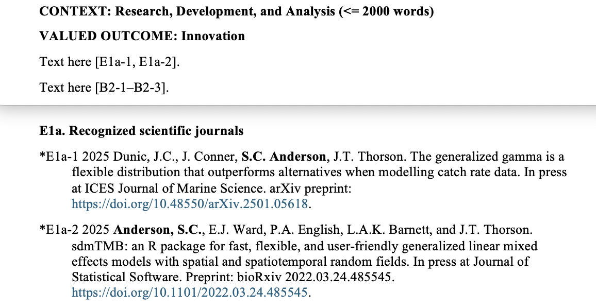

# resdown

> Research Scientist (*RES*) dossier + Markdown (*down*) 

<!-- badges: start -->
[](https://github.com/seananderson/resdown/actions/workflows/R-CMD-check.yaml)
<!-- badges: end -->

Unofficial Markdown template and R code to produce dossiers for Fisheries and
Oceans Canada Research Scientists under the Career Progression Management
Framework.

The dossier format includes considerable cross referencing of "Annex" evidence
in a custom format. The markdown file `dossier.md` is processed by the function
`render_dossier()` to number or letter subsections, generate the cross
references, and render the document into a `.docx` file that can be copied into
the official template with (hopefully) minimal modifications. A `.html` and
`.pdf` version can also be generated for faster iteration while writing.

## Installation

```r
# install.packages("pak")
pak::pkg_install("seananderson/resdown")
```

## Example

Copy the Markdown template:

```r
file.copy(system.file("dossier.md", package = "resdown"), ".", overwrite = FALSE)
```

Then edit `dossier.md` as desired.

Render the dossier:

```r
resdown::render_dossier(output = "dossier.docx")
```

```r
list.files(pattern = "dossier\\.")
#> [1] "dossier.docx" "dossier.md"
```

Copy the contents of `dossier.docx` into the official `.docx` template.

By default, `resdown::render_dossier()` also renders a PDF that may be helpful
while writing.

## Syntax

Use regular [Pandoc markdown](https://pandoc.org/MANUAL.html#pandocs-markdown).
Follow the formatting in `dossier.md` that is copied in the above example.
resdown adds the following syntax:

Annex subsections that require incrementing a number:

```md
## B{subsec}. Subsection title
```

Annex subsections that require incrementing a letter:

```md
## E1{subsec-letter}. Subsection title
```

Annex evidence item:

```md
@mylabel Evidence item or paragraph.
```

These evidence items can be referenced in the main RES dossier as:

```md
## VALUED OUTCOME: Innovation

Your text here [@mylabel].
```

When the document is rendered, the `@mylabel` labels will be replaced with
appropriately numbered/lettered tags in both the annex and main text:


